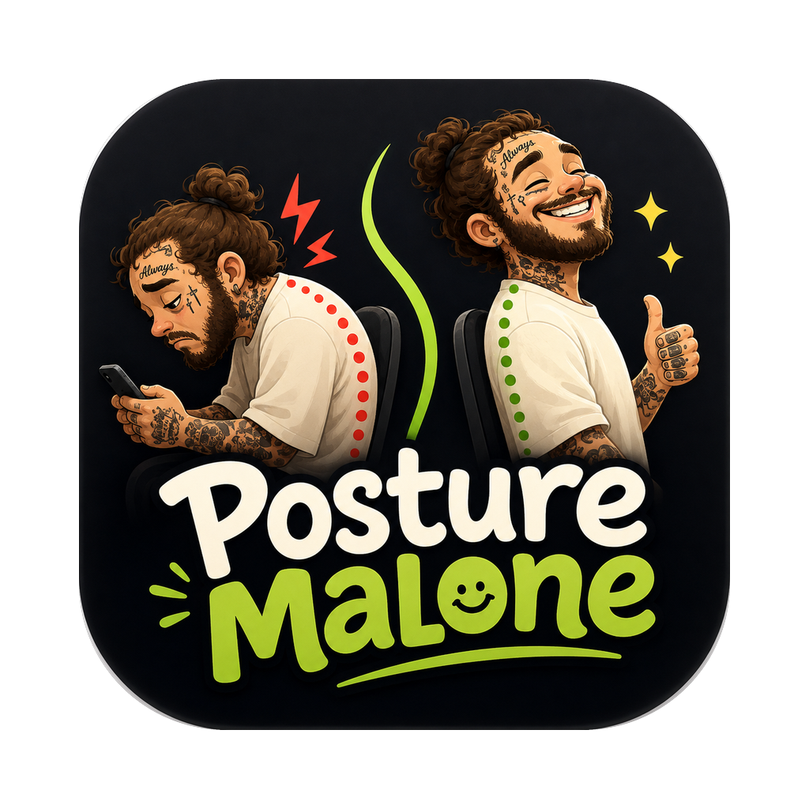

<p align="center">
  
</p>

<h1 align="center">Posture Malone</h1>

<p align="center"><i>You've been slouchin' too long — he notices, and says so in your ears.</i></p>

A menu-bar macOS posture coach powered by your AirPods' motion sensors.
No Dock icon, no windows. Just a brain 🧠 in your menu bar.

## How it works

- 🎧 AirPods stream head motion (`CMHeadphoneMotionManager`, public API)
- 📐 Neck tilt is measured against **gravity** — absolute, drift-free
- 🗣️ Slouch too long → a phrase **you write** is spoken into your ears
- 📊 Upright vs slouched time tracked per day (last 7 days)

## Requirements

| | |
|---|---|
| macOS | 14+ |
| AirPods | any model with spatial-audio head tracking |
| Build | Xcode — or just Command Line Tools |

## Run

```bash
./build.sh && open "build/Posture Malone.app"
```

Or open `PostureMalone.xcodeproj` in Xcode and hit ⌘R.

> First launch asks for **Motion & Fitness** access. Allow it — that's the whole app.

## Setup (10 seconds)

1. Put the AirPods in
2. Click 🧠 → sit the way you want to sit → **Set Upright Posture**
3. Done. Slouch and find out.

## The popover

| Thing | What it does |
|---|---|
| Gauge | live neck tilt, threshold marked |
| **Set Upright Posture** | recalibrate — do it whenever your setup changes |
| Threshold | how far you can tilt (default 15°) |
| Delay | how long before he speaks up (default 60s, repeats) |
| Phrase + ▶ | what he says, with preview |
| ⏸ | pause everything (icon shows a pause badge) |
| 🧠 → `18°` | icon shows your tilt while you're slouching |

Stats only count while the buds are in and streaming. Pauses and gaps never count.

## Troubleshooting

- **"Waiting for AirPods motion…"** → buds must be connected to *this Mac* and in your ears. iPhone stole them? Play any audio on the Mac.
- **Permission denied** → System Settings › Privacy & Security › Motion & Fitness → enable Posture Malone.

---

<p align="center">Sibling project: <a href="https://github.com/pratikaman/AirPodsHeadTracker">AirPodsHeadTracker</a> — the 3D head-orientation viewer this grew out of.<br/>
Project file generated with <a href="https://github.com/yonaskolb/XcodeGen">xcodegen</a> (<code>xcodegen generate</code> after changing file layout).</p>
